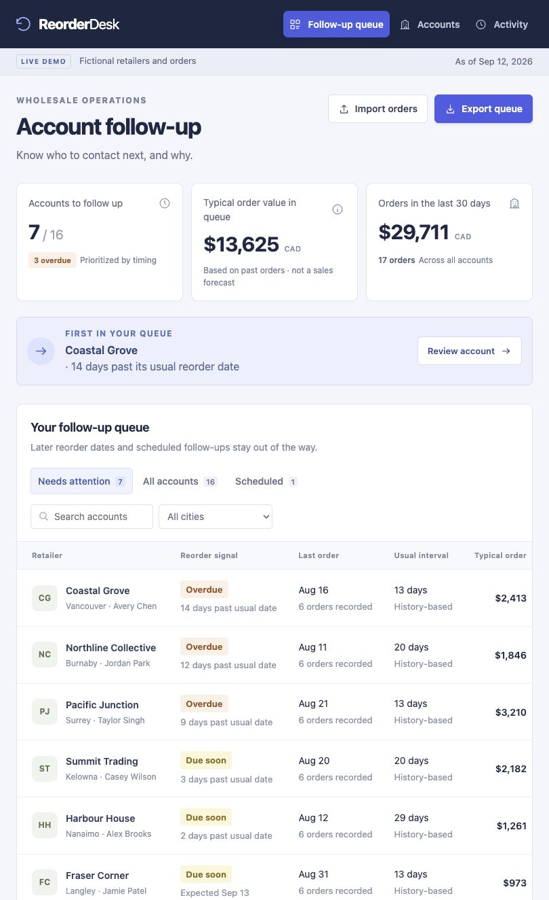

# Reorder Desk

A working wholesale sales CRM that turns order history into a clear daily follow-up queue.

**[Open the live demo](https://reorder-desk.pages.dev)**



**The business question:** Which retailer accounts should a sales rep contact today, and what evidence supports that decision?

Reorder Desk combines repeat-order timing, account context, conversation notes, and scheduled next steps. It is an independent portfolio project by **Simran Mohar**, inspired by the wholesale distribution model used by companies such as Herbal Dispatch. It is not commissioned by or affiliated with Herbal Dispatch.

## Try the workflow

1. Open the demo. It starts with **16 fictional retailers and 96 orders**.
2. Review **Coastal Grove**, the first account in the follow-up queue.
3. Inspect its order history and the explanation for its estimated reorder date.
4. Log a conversation and choose a future follow-up date.
5. The account moves to **Scheduled** and leaves today's active queue. Refresh the page: the change remains.
6. Export the queue as CSV, or validate and import a new order dataset.

No installation, account registration, paid API, or company credentials are needed to use the hosted demo. All sample account names, people, emails, and financial figures are fictional.

## Features

- **Explainable reorder signals:** median intervals between recent order dates, with a visible 30-day baseline when history is sparse.
- **Account workspace:** contact details, order records, an order-value chart, conversation history, and the next follow-up.
- **Daily queue:** due, overdue, and scheduled accounts with search and city filters.
- **CSV import:** preview before replacing a dataset; validation for dates, currency, duplicate orders, conflicting account details, and malformed CSV.
- **CSV export:** a usable account follow-up list, with spreadsheet formula prefixes neutralized.
- **Local persistence:** account data and activity remain on the visitor's device.
- **Responsive interface:** keyboard-accessible native dialogs and a compact account-card layout on phones.
- **Optional WebMCP read interface:** supporting browsers can inspect the queue and open a specified account using the same application state.

## How the signals work

1. Group order history by account, ignoring future orders.
2. Deduplicate order dates and calculate the latest six intervals.
3. With at least three distinct order dates, use the rounded median interval. Otherwise use a clearly labelled 30-day baseline.
4. Add that interval to the latest order date to estimate the next reorder date.
5. Include the account in the queue three days before that estimate. Mark it overdue only when more than seven days have passed.
6. Respect a future agreed follow-up. A purchase after that conversation closes the earlier follow-up cycle.
7. Sort by days past the usual reorder date, then by typical order value.

Typical order value is the average of the last six orders. The queue total is the sum of those averages, **not a revenue forecast, profit estimate, or measured sales improvement**. The reporting date remains fixed within a dataset to make demos and comparisons reproducible; Reset demo refreshes it to today.

## Run locally

Requires Node.js 20 or later. There are **no runtime dependencies to install**.

```sh
npm start
```

Open `http://127.0.0.1:4173`. To use a different port, set `PORT` before starting.

```sh
npm test
npm run check
```

Tests cover calendar boundaries, cadence calculation, sparse histories, follow-up scheduling, new-order resets, CSV round trips, validation, and export escaping.

The public demo is hosted on Cloudflare Pages as `reorder-desk`. Deploy the contents of `dist/` using Pages Direct Upload; no build step is required.

## Import format

Use one row per completed order, not one row per line item. `order_total` is a positive CAD amount, without a currency symbol or thousands separators. Keep account details consistent for each `account_id`.

```csv
account_id,account_name,contact_name,email,city,order_id,order_date,order_total
A001,Example Retailer,Alex Example,alex@example.com,Vancouver,ORD-001,2026-08-01,1250.00
A001,Example Retailer,Alex Example,alex@example.com,Vancouver,ORD-002,2026-08-15,1380.00
A001,Example Retailer,Alex Example,alex@example.com,Vancouver,ORD-003,2026-08-29,1295.00
```

The app can generate a full sample CSV from its import dialog. Imports are limited to 10,000 orders and 2 MB. A valid import replaces the current dataset and activity history only after explicit confirmation in the interface. Failed validation leaves existing data unchanged.

## Architecture

The project uses JavaScript ES modules, semantic HTML, CSS, the browser's local storage, and Node's built-in test runner. A small static server is provided for local development; deployment serves static files directly.

```text
dist/
  index.html        Document and metadata
  app.js            Rendering, accessible dialogs, application actions
  styles.css        Responsive workspace and account views
  lib/domain.js     Pure date, cadence, queue, and summary functions
  lib/csv.js        Parsing, validation, import, and safe CSV serialization
  lib/seed.js       Reproducible fictional demo data
test/              Business-rule and import/export tests
scripts/serve.mjs   Development-only static server
docs/              Product rationale and validation notes
```

This deliberately keeps the first version small and easy to inspect. It avoids adding a paid service or complicated infrastructure before a workflow is validated.

## Practical limits

This is a **single-user prototype**, not a production CRM. It has no team authentication, shared database, automatic sending, inventory integration, or connection to Herbal Dispatch's systems. Browser data can be cleared or lost; use sample or non-sensitive data. Imported order history can be exported elsewhere, but the queue export is not a complete activity backup.

The cadence method assumes reasonably regular repeat ordering. It does not model seasonality, stock availability, promotions, account credit holds, or a buyer's current intentions. A human should review the evidence before contacting an account. Commercial outreach permission and company policies remain outside this demo.

If a real team found the workflow useful, the next step would be to understand its existing CRM and integrate with that system, then add shared storage and permissions if needed.

## Development approach

Created as an **AI-assisted portfolio project**, using Codex for implementation and verification. The business workflow, assumptions, validation evidence, and limitations are documented so the project can be reviewed and discussed honestly. No production customer deployment or revenue outcome is claimed.

See [the product rationale](docs/product-rationale.md) and [validation notes](docs/validation.md).
